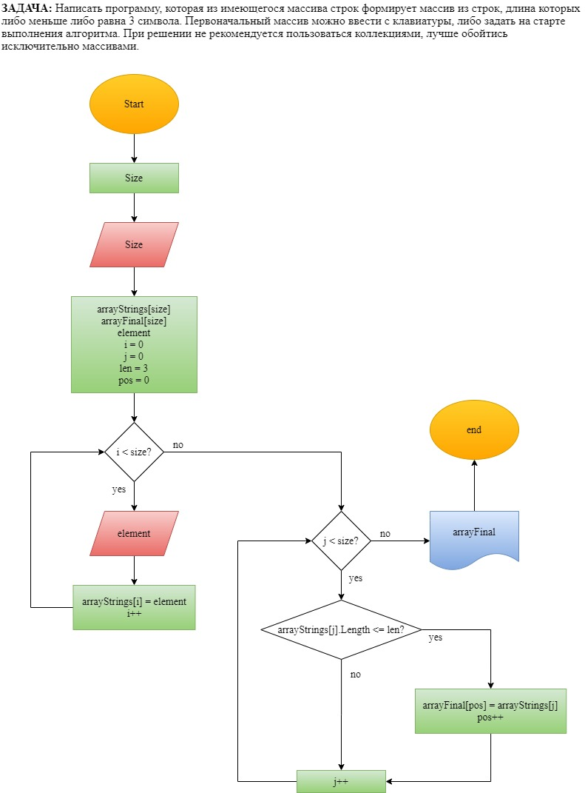

# Контрольная работа

## ЗАДАЧА:
Написать программу, которая из имеющегося массива строк формирует массив из строк, длина которых меньше либо равна 3 символа. Первоначальный массив можно ввести с клавиатуры, либо задать на старте выполнения алгоритма. При решение не рекомендуется пользоваться коллекциями, лучше обойтись исключительно массивами.

## Перечень задач:
1. Создать репозиторий на GitHub
2. Нарисовать блок схему алгоритма
3. Снабдить репозиторий оформленным текстовым описанием (файл Readмe.md)
4. Написать программу, решающую поставленную задачу
5. Использовать контроль версий в работе над этим небольшим проектом (не должно быть так что все залито одним коммитом, как минимум этап 2, 3 и 4 должны быть расположены в разных коммитах)

# Решение 

Задание 2. Создание алгоритма решения задачи

